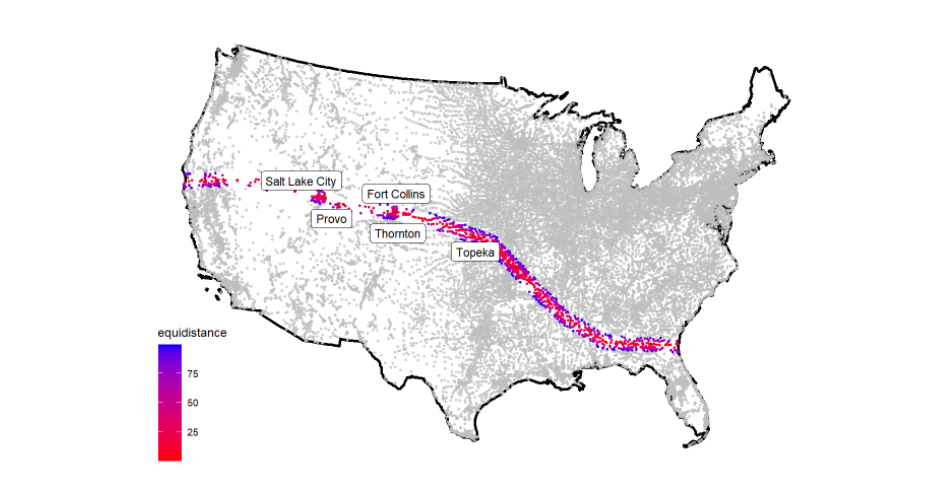
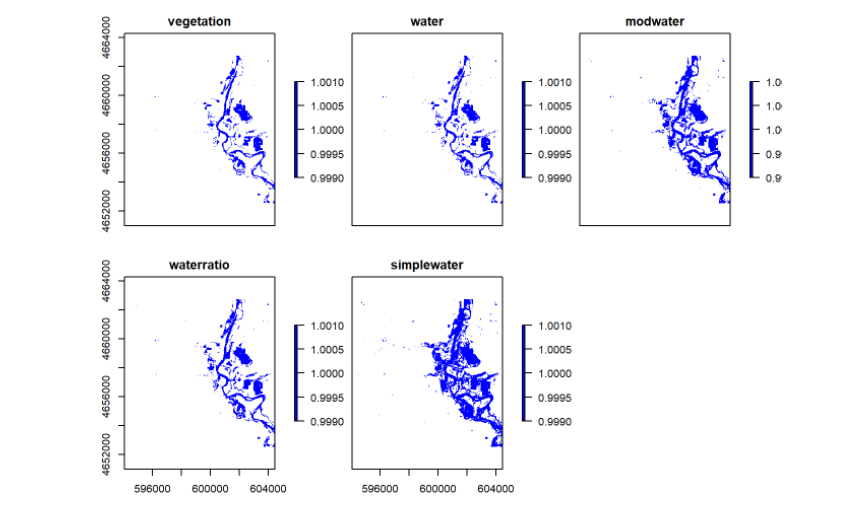

In <i class="far fa-sun" style="color:yellow;"></i>Summer 2020<i class="far fa-sun" style="color:yellow;"></i> I took an <i class="fab fa-r-project" style="color:blue;"></i>-based GIS class. I wrote some code and created some cool stuff on the internet.

## [Building a project website](index.html)

- Built a personal website to host the various projects completed throughout the course
- Learned to push website updates through github
- Practiced creating aesthetically pleasing web pages

## [COVID-19 Pandemic](https://kplouffe.github.io/geog-176A-labs/lab-02.html)

- Analyzed COVID-19 data to see where in California cases were growing
- Created lists of counties that need to be watched by calculating per capita infection rates
- Practice generating tables using kable
- Created faceted bar plots to show case count changes over time in multiple states

## [Distances and the Border Zone](https://kplouffe.github.io/geog-176A-labs/lab-03.html)

- Learned to use simple features objects to generate object boundaries, and then manipulate them to create spatial graphs.
- Learned to manipulate coordinate reference systems to according to what is needed for a calculation
- Calculated distances between geographic objects
- Generated maps shows hwo many people and what cities are located within certain geographic boundaries
- Quantified how many people live within the 100 mile border zone throughout the United States

## [Tesselations, Point-in-Polygon](https://kplouffe.github.io/geog-176A-labs/lab-04.html)

- Created different tessellations inside the United states including hex, voronoi, square, and triangulation
- Simplified geometries to speed up calculation times
- Learned to write functions to expedite repetitive processes such as mapping tasks
- Used point-in-polygon counts to aggregate point data and figure out what the uses of different dams are

## [Rasters and Remote Sensing](https://kplouffe.github.io/geog-176A-labs/lab-05.html)

- Practiced generating an area of interest from a CSV file by converting it into a simple features object, then creating a bounding box
- Created raster data that represented flood data and manipulated it to create a flood map
- Analyzed rasters using raster algebra to generate thresholds which could be used to find if a cell in the raster was considered to be flooded or not
- Performed a complete flood analysis using landsat imagery

## [Flood Risk in Mission Creek: Past, Present, Future](https://kplouffe.github.io/geog-176A-labs/lab-06.html)

- Collected basin boundaries from USGS data and elevation data from the elevatr package.
- Performed a terrain analysis using by creating a Height Above Nearest Drainage raster
- Assessed the number of buildings impacted by a 2017 flood using the HAND raster
- Learned how to create a Flood Inundation Map library and animating it as a GIF to see how floods will effect an area

