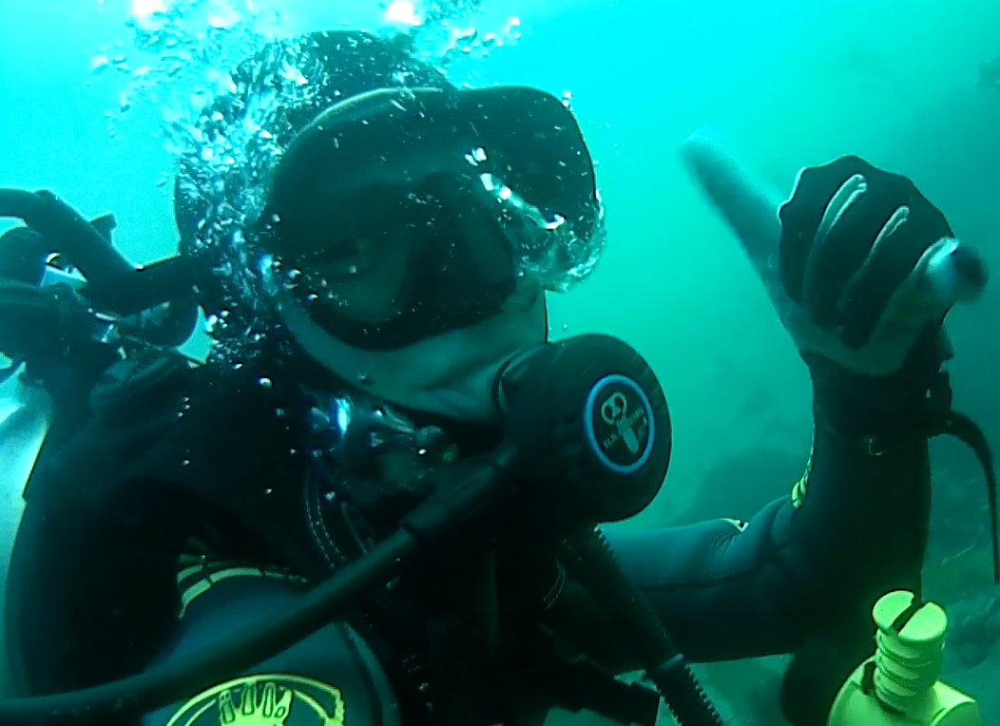

  

{width="25%"}

  

## Kyler Plouffe
##### kplouffe@ucsb.edu
##### https://github.com/kplouffe

  I'm an  <i class="fas fa-fish" style="color:#33B5FF;"></i> Aquatic Biology <i class="fas fa-fish" style="color:#33B5FF;"></i>  major within the EEMB department at UCSB. During the school year you can find me working in the REEF down on campus point. I'm interested in aquaculture and its many applications.

